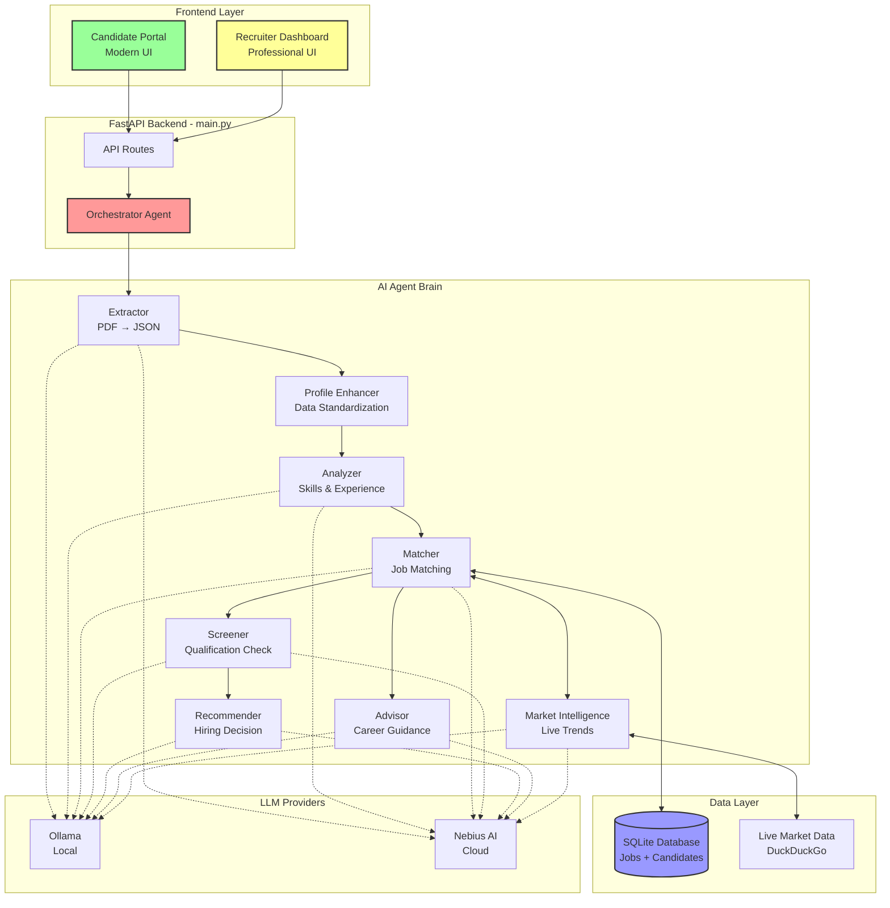
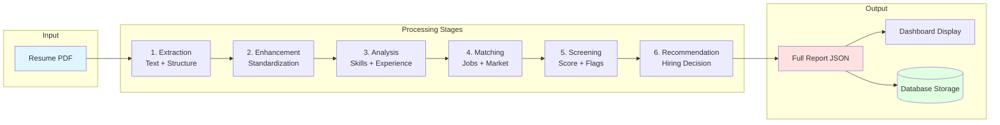

# AI Recruiter Agency 🤖💼

An enterprise-grade AI-powered recruitment automation system featuring dual dashboards, intelligent agent orchestration, and persistent candidate management. Built with FastAPI, modern web technologies, and advanced LLM capabilities.

## 🌟 Key Features

### **Dual Dashboard Architecture**
- **🎓 Candidate Portal** (`/`): Modern, glassmorphic UI for job seekers to analyze resumes and receive career guidance
- **📊 Recruiter Dashboard** (`/recruiter`): Professional interface for bulk resume processing, screening, and hiring decisions
- **🔄 Unified Backend**: Single FastAPI application (`main.py`) serving both interfaces with shared agent infrastructure

### **Intelligent Agent System**
- **8 Specialized AI Agents**: Extractor, Enhancer, Analyzer, Matcher, Screener, Recommender, Advisor, Market Intelligence
- **Orchestrated Workflow**: Seamless data flow through extraction → enhancement → analysis → matching → screening → recommendation
- **Dynamic Scoring**: Real-time evaluation with 0-100 scoring and confidence levels
- **Profile Enhancement**: AI-powered data standardization and enrichment

### **Advanced Matching & Intelligence**
- **Hybrid Job Matching**: Combines SQLite database jobs with live market trends (via DuckDuckGo search)
- **Market Intelligence**: Real-time job market analysis and trend detection
- **Multi-Source Results**: Database jobs + live market opportunities with source attribution

### **Enterprise Features**
- **Persistent Storage**: SQLite database for candidates and job listings
- **Duplicate Detection**: Intelligent file-based deduplication
- **Bulk Processing**: Sync entire resume folders with one click
- **Comprehensive Reports**: Full-stack analysis with screening scores, red flags, and recommendations

### **Flexible LLM Backend**
- **Multi-Provider Support**: Ollama (local) and Nebius AI (cloud)
- **Dynamic Switching**: Runtime provider selection
- **Configurable Models**: Easy model customization via `config.py`

## 🏗️ System Architecture

### High-Level Overview



### Data Flow Architecture



## 🚀 Getting Started

### Prerequisites

- **Python 3.10+**
- **Ollama** installed and running ([Download](https://ollama.com/))
- **Model**: `gemma-2-2b-it` (or configure your preferred model)
  ```bash
  ollama pull google/gemma-2-2b-it
  ```
- **(Optional)** Nebius AI API Key for cloud-based processing

### Installation

1. **Clone the repository**:
   ```bash
   git clone <repository-url>
   cd AI-Recruiter-Agency
   ```

2. **Set up virtual environment**:
   ```bash
   python -m venv venv
   
   # Windows
   .\venv\Scripts\activate
   
   # macOS/Linux
   source venv/bin/activate
   ```

3. **Install dependencies**:
   ```bash
   pip install -r requirements.txt
   ```

4. **Configure LLM Provider** (Optional):
   - Edit `config.py` to set your preferred provider and model
   - For Nebius AI, set your API key in `config.py`

### Running the Application

**Unified FastAPI Server** (Serves both dashboards):
```bash
uvicorn main:app --reload
```

**Access Points**:
- 🎓 **Candidate Portal**: http://localhost:8000/
- 📊 **Recruiter Dashboard**: http://localhost:8000/recruiter

**Legacy Streamlit Dashboard** (Optional):
```bash
streamlit run app.py
```
*Access at: http://localhost:8501*

## 📖 Usage Guide

### For Recruiters

1. **Navigate to Recruiter Dashboard**: http://localhost:8000/recruiter
2. **Sync Resumes Folder**: Click "Sync Resumes Folder" to process all PDFs in `resumes/` directory
3. **Or Upload Manually**: Drag and drop resume files
4. **View Candidates**: Browse the candidate table with scores and recommendations
5. **Deep Dive**: Click "View Report" to see:
   - **Analysis Tab**: Profile, skills, education, achievements
   - **Job Matches Tab**: Top job fits with match scores (Database + Live Market)
   - **Screening Tab**: Screening score, report, and red flags
   - **Recommendation Tab**: Hiring status and final verdict

### For Candidates

1. **Navigate to Candidate Portal**: http://localhost:8000/
2. **Upload Resume**: Drag and drop your PDF resume
3. **Receive Instant Analysis**:
   - Professional profile summary
   - Skills assessment
   - Job matches with compatibility scores
   - Personalized career advice and improvement tips

## 📁 Project Structure

```
AI-Recruiter-Agency/
├── agents/                      # AI Agent Brain
│   ├── base_agent.py           # Base class with LLM integration
│   ├── orchestrator.py         # Workflow coordinator
│   ├── extractor_agent.py      # PDF → JSON extraction
│   ├── profile_enhancer_agent.py # Data standardization
│   ├── analyzer_agent.py       # Skills & experience analysis
│   ├── matcher_agent.py        # Job matching logic
│   ├── screener_agent.py       # Qualification screening
│   ├── recommender_agent.py    # Hiring recommendations
│   ├── candidate_advisor_agent.py # Career guidance
│   └── market_intelligence_agent.py # Live market trends
│
├── db/                          # Database Layer
│   ├── database.py             # SQLite operations
│   ├── schema.sql              # Database schema
│   └── jobs.sqlite             # Job listings + candidates
│
├── templates/                   # Frontend Templates
│   ├── index.html              # Candidate Portal UI
│   └── recruiter_dashboard.html # Recruiter Dashboard UI
│
├── static/                      # Frontend Assets
│   ├── css/
│   │   └── style.css           # Candidate Portal styles
│   └── js/
│       └── app.js              # Candidate Portal logic
│
├── resumes/                     # Resume storage folder
├── uploads/                     # Temporary upload directory
│
├── main.py                      # Unified FastAPI application
├── app.py                       # Legacy Streamlit dashboard
├── config.py                    # Configuration & LLM settings
├── requirements.txt             # Python dependencies
└── README.md                    # This file
```

## 🎯 Core Agents Explained

| Agent | Purpose | Key Features |
|-------|---------|--------------|
| **Extractor** | PDF parsing | Converts resumes to structured JSON with personal info, experience, education, skills |
| **Profile Enhancer** | Data quality | Standardizes and enriches extracted data for better downstream accuracy |
| **Analyzer** | Deep analysis | Evaluates technical skills, experience level, achievements, and education |
| **Market Intelligence** | Live trends | Searches DuckDuckGo for current job market data and trending roles |
| **Matcher** | Job matching | Combines database jobs + live market data, calculates compatibility scores (0-100) |
| **Screener** | Qualification check | Generates screening score (0-100), identifies red flags, provides detailed report |
| **Advisor** | Career guidance | Offers personalized tips for resume improvement and career development |
| **Recommender** | Hiring decision | Provides final verdict (Recommended/Not Recommended/Pending) with justification |

## 🔧 Configuration

### LLM Provider Setup

Edit `config.py`:

```python
# Default provider: "ollama" or "nebius"
DEFAULT_PROVIDER = "nebius"

# Ollama settings
OLLAMA_BASE_URL = "http://localhost:11434"
OLLAMA_MODEL = "llama3.2"

# Nebius settings
NEBIUS_API_KEY = "your-api-key-here"
NEBIUS_MODEL = "google/gemma-2-2b-it"
```

### Database Configuration

The system automatically initializes the SQLite database with:
- **Jobs table**: Pre-seeded with sample job listings
- **Candidates table**: Stores processed candidate data with full reports

## 🐛 Troubleshooting

### Common Issues

**Issue**: "Ollama connection refused"
- **Solution**: Ensure Ollama is running (`ollama serve`)

**Issue**: "Model not found"
- **Solution**: Pull the required model (`ollama pull google/gemma-2-2b-it`)

**Issue**: "Duplicate candidates appearing"
- **Solution**: Clear database and re-sync (`rm db/jobs.sqlite` then restart)

**Issue**: "Screening/Recommendation tabs empty"
- **Solution**: Refresh browser to load latest frontend updates

## 🚧 Recent Updates

- ✅ Unified FastAPI backend serving both dashboards
- ✅ Persistent candidate storage with SQLite
- ✅ Duplicate detection and prevention
- ✅ Screening and Recommendation tab population in modal
- ✅ Text wrapping for recommendation column
- ✅ Focused context for improved LLM accuracy
- ✅ Dynamic scoring system (0-100 scale)
- ✅ Live market intelligence integration
- ✅ Enhanced error handling and logging

## 📊 Performance Notes

- **Processing Time**: ~30-60 seconds per resume (depends on LLM provider)
- **Bulk Processing**: Processes resumes sequentially with duplicate skipping
- **Database**: Lightweight SQLite, suitable for 1000+ candidates
- **Scalability**: For production use, consider PostgreSQL and async processing

## 📚 Dataset Acknowledgment

This project uses sample CV data from the [Sample CVs Dataset for Analysis](https://www.kaggle.com/datasets/hussnainmushtaq/sample-cvs-dataset-for-analysis) available on Kaggle. The dataset provides realistic resume examples for testing and demonstrating the AI recruitment system's capabilities.

**Dataset Source**: Hussnain Mushtaq - Kaggle
**License**: Check dataset page for specific licensing terms
**Usage**: Testing, development, and demonstration purposes

## 🤝 Contributing

Contributions are welcome! Please feel free to submit pull requests or open issues for bugs and feature requests.

## 📄 License

MIT License - see LICENSE file for details

---

**Built with ❤️ using FastAPI, LLMs, and Modern Web Technologies**
