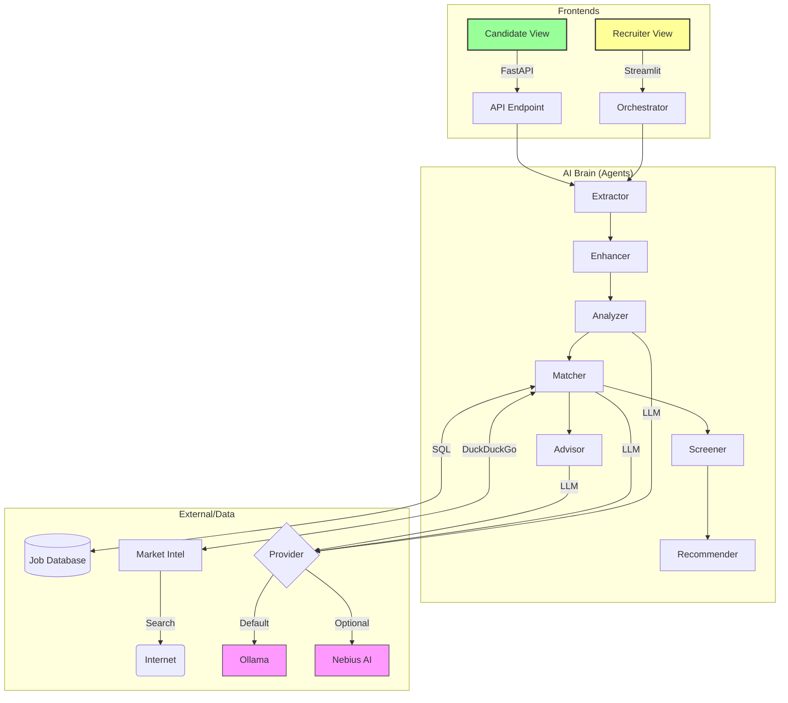

# AI Recruiter Agency 🤖💼

An AI-powered recruitment automation system that uses specialized LLM agents to process resumes, analyze candidate profiles, match them with job descriptions, and provide hiring recommendations.

## 🌟 Features

- **Dual-View Platform**:
    - **Recruiter View**: Streamlit-based dashboard for bulk processing and deep-dive screening.
    - **Candidate View**: FastAPI-based portal with modern UI for resume analysis and career advice.
- **Multi-Agent Orchestration**: Specialized agents for extraction, enhancement, analysis, matching, screening, and recommendation.
- **Hybrid Job Matching**: Combines results from a local **SQLite database** and **Live Market Trends** (via web simulation).
- **Flexible LLM Backend**: Supports **Ollama** (local) and **Nebius AI** (cloud) with dynamic switching.
- **AI Career Advisor**: Provides candidates with actionable tips and profile optimizations.

## 🏗️ Architecture

The system features a dual-view architecture powered by a shared "Brain" of AI Agents.

### System Overview


### Core Agents

1.  **Extractor Agent**: Parses PDF resumes into structured JSON data.
2.  **Profile Enhancer**: Polishes and standardizes extracted data for better downstream accuracy.
3.  **Analyzer Agent**: Performs deep-dive analysis of skills, experience, and education.
4.  **Market Intelligence**: Scans live trends and simulates real-time job openings.
5.  **Matcher Agent**: Matches candidates against DB jobs and live market data.
6.  **Screener Agent**: Evaluates qualifications and red flags with dynamic scoring.
7.  **Advisor Agent**: Generates strategic career tips for the candidate.
8.  **Recommender Agent**: Provides the final hiring recommendation for recruiters.

## 🚀 Getting Started

### Prerequisites

- [Ollama](https://ollama.com/) installed and running.
- Python 3.10+
- The `llama3.2` model downloaded (`ollama pull llama3.2`).
- (Optional) Nebius AI API Key for cloud-based analysis.

### Installation

1.  **Clone the repository**:
    ```bash
    git clone <repository-url>
    cd AI-Recruiter-Agency
    ```

2.  **Set up a virtual environment**:
    ```bash
    python -m venv venv
    .\venv\Scripts\activate  # Windows
    # source venv/bin/activate  # macOS/Linux
    ```

3.  **Install dependencies**:
    ```bash
    pip install -r requirements.txt
    ```

## 🛠️ Usage

### 📊 Recruiter Dashboard (Streamlit)
Ideal for HR teams to process applications and get hiring recommendations.
```bash
streamlit run app.py
```
*Access at: http://localhost:8501*

### 🎓 Candidate Portal (FastAPI)
A "wow" experience for candidates to get instant feedback and job matches.
```bash
uvicorn candidate_app:app --reload
```
*Access at: http://localhost:8000*

## 📁 Project Structure

- `agents/`: The AI "Brain" - specialized Python agents.
- `db/`: Database logic and seed data (`jobs.sqlite`).
- `static/` & `templates/`: Frontend assets for the Candidate Portal.
- `app.py`: Streamlit application file.
- `candidate_app.py`: FastAPI application file.
- `config.py`: Centralized LLM and app configuration.
- `requirements.txt`: Project dependencies.

## ⚖️ License

MIT License
